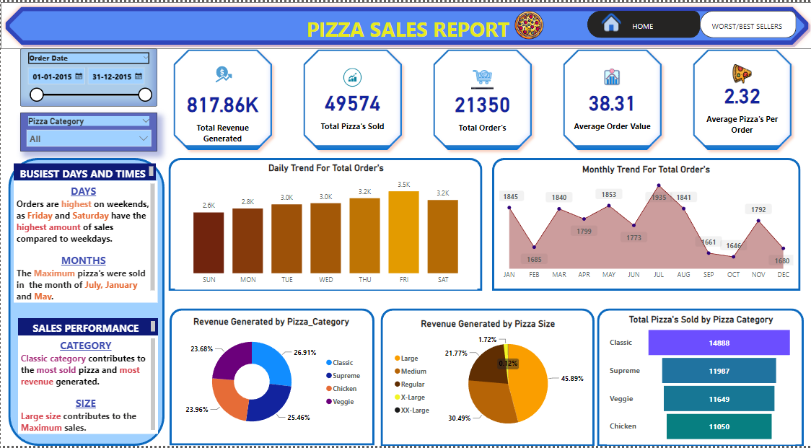
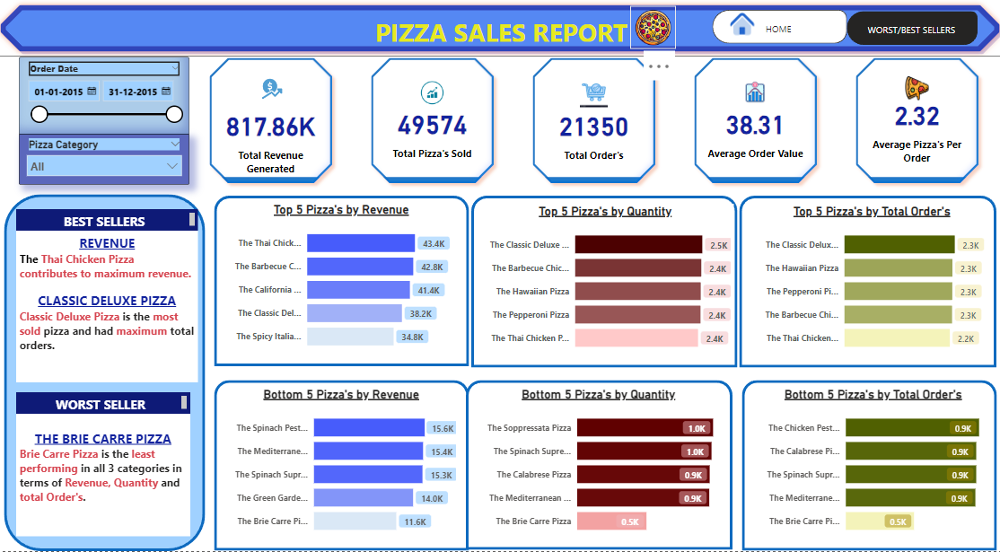

# Pizza Sales Project(POWER BI/ SQL)

---
## SQL QUERIES FOR THIS PROJECT
Click the link below to check the sql code for the business problem solve.
https://github.com/Heysen3101/Pizza_Sales_Project/blob/main/code.sql
## INTRODUCTION
This Power BI project aims to analyze the sales performance of a pizza store for the year 2015. Leveraging a well-designed dashboard, the project provides crucial insights that could inform the company's strategic planning for the upcoming year. Notable metrics include revenue generation, top-selling pizzas, and underperforming products.
**_Disclaimer_:** _The Dataset used for this report is strictly used to demonstrate capabilities of Power BI._

## SKILLS/ CONCEPTS DEMONSTRATED:
1) DAX (Data Analysis Expressions)
2) Power Query
3) Quick Measures
4) Page Navigation
5) Data Modeling
6) Filters and Buttons

## PROBLEM STATEMENT
1) What are the Total Revenue, Average Order Value, Total Pizzas Sold, Total Orders Placed, and Average Pizzas Per Order?
2) What are the daily and monthly trends for total orders?
3) What is the sales percentage breakdown by pizza size and category?
4) What are the top 5 and bottom 5 pizzas based on revenue and quantity sold?

## DASHBOARD(Problem 1/2)

## DASHBOARD(Problem 2)

## INSIGHTS
1) Dashboard 1: The total revenue generated was $817.86k, with a total of 21,350 orders placed and an average order value of $38.31.

2) Dashboard 2: The weekends witnessed the highest sales volume. January, July, and May emerged as the busiest months. The Classic category and Large-sized pizzas were the best performers.

3) Top Sellers: The Thai Chicken pizza led in terms of revenue, whereas the Classic Deluxe Pizza was the frontrunner in both quantity and total orders.

## REFERENCE
DATASET USED FOR THE PROJECT --> https://drive.google.com/file/d/147-jWlbMXgcBGYmwMWm1k_ZebDOsbD-b/view?usp=sharing

